<h1>README.MD</h1>

<blockquote>

Примечание: В силу не хватки времени из-за учебы и неопытности инженера в плане микросервисной архитектуры, некоторый функционал всего проекта не был реализован. Инженер дает себе отчетность в том что данный проект можно было сделать лучше, чем он есть на самом деле.

</blockquote>

<h2>Используемые технологии</h2>
<ul>
    <li>Java 17</li>
    <li>Spring Boot 3.3</li>
    <li>Mockito</li>
    <li>Spring Security</li>
    <li>Lombok</li>
    <li>PostgreSQL</li>
    <li>H2 DB</li>
</ul>

<h2> Схема взаимодействия CDR, BRT и HRS микросервисов.</h2>

Все они общаются между собой через брокер RabbitMQ, в силу того что все данные посылаемые между микросервисами критически важные. Таблицы brt-db и hrs-db - были полностью спроектированы инженером, в силу того, что у аналитика не было возможности спроектировать их, из-за учебы.

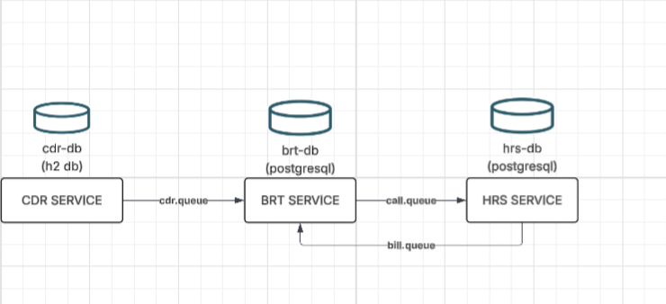

<ol>
    <li>Данные генерируются в Cdr Service и отправляются в очередь cdr.queue</li>
    <li>Brt Service получает cdr-ы из очереди cdr.queue и затем сохраняет в базу данные информацию о звонке(Номер пользователя который совершил звонок, время, длительность и тип звонка).</li>
    <li>После сохранения информации о звонке, Brt Service отправляет в очередь call.queue информацию о длительности звонка и идентификатора пользователя, чтобы сервис HRS смог выписать счет за звонок.</li>
    <li>Hrs Service определяет тариф пользователя и выписывает ему счет. Также сервис списывает деньги с абонентов с помесячной абонентской платой. После всех расчетов, hrs service отправляет счет в очередь bill.queue.</li>
    <li>Brt Service перехватывает счета отправленные сервисом Hrs и списывает деньги с баланса абонента.</li>
</ol>

<blockquote>В рамках проекта используется "дефолтные" значения для подключения к базам данных и брокеру сообщений. Инженер осведомлен что в реальных проектах должен присутствовать надежные данные для получения доступа к данным системы, однако в рамках проекта было принято решение не заморачиваться над данными для аутентификации</blockquote>

<h2>CDR</h2>

Данные для доступа в h2-console

<ul>
    <li>Driver class: org.h2.Driver</li>
    <li>JDBC URL: jdbc:h2:mem:testdb</li>
    <li>User Name: admin</li>
    <li>Password: (отсутствует)</li>
</ul>

 У Cdr Service есть один эндпоинт: <u><i>/cdr/generate</i></u>, который генерирует звонки. Количество генерируемых cdr и количество cdr которые должны отправляться в брокер сообщений за раз - предопределены в application.yaml:

<pre><code>cdr:
    max-cdr-amount-before-sending-to-queue: 10
    amount-of-cdr-generations-at-one-time: 1000</code>
</pre>

 Сгенерированные данные отправляются в BRT-сервис в формате Json вместо CSV в силу следующих причин:

<ul>
    <li><strong>Поддержка вложенности</strong> — легко передавать вложенные объекты и массивы (например, тариф, детали маршрута).</li>
    <li><strong>Гибкость</strong> — можно добавлять новые поля без нарушения структуры.</li>
    <li><strong>Совместимость</strong> — нативно поддерживается в API, микросервисах, RabbitMQ, Kafka и других системах.</li>
    <li><strong>Автоматическая сериализация</strong> — легко работает с Java (Jackson), Python и другими языками.</li>
    <li><strong>Стандарты валидации</strong> — можно использовать JSON Schema для проверки корректности данных.</li>
    <li><strong>Устойчивость к ошибкам</strong> — структура "ключ-значение" уменьшает вероятность ошибок при чтении.</li>
    <li><strong>Читаемость</strong> — формат легко читается как человеком, так и машиной.</li>
    <li><strong>Подходит для логирования и хранения</strong> — удобно писать в лог-файлы или сохранять в NoSQL.</li>
  </ul>

После генерации количества звонков, который предопределен в свойстве cdr.max-cdr-amount-before-sending-to-queue в application.yaml, сгенерированные cdr отправляются в очередь сообщений call.queue и далее обрабатываются BRT сервисом

<h2>BRT</h2>

Данные для подключения PostgreSQL:

<ul>
    <li>Username: postgres</li>
    <li>Password: postgres</li>
    <li>Database: brtdb</li>
    <li>Ports: 5432:5432</li>
</ul>

<h3>Эндпоинты:</h2>
<ul>
    <li>/api/balance/top-up - пополнение баланса</li>
    <li>/api/abonent/create - регистрация нового абонента</li>
</ul>

<h3>Схема бд BRT</h3>

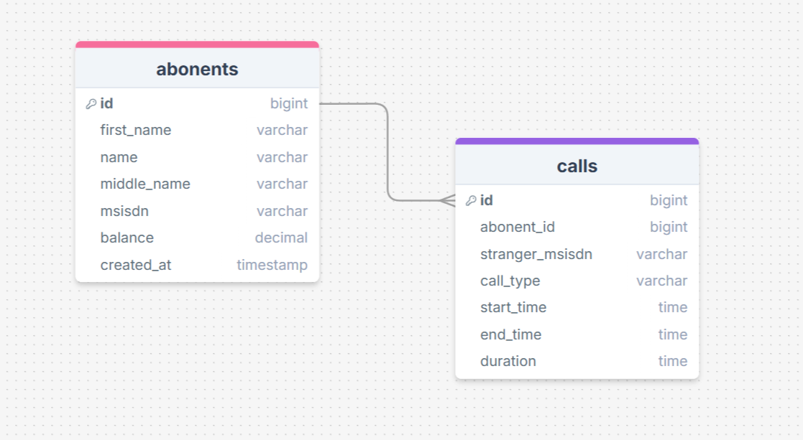

<h3>Тесты</h3>

AbonentServiceTest

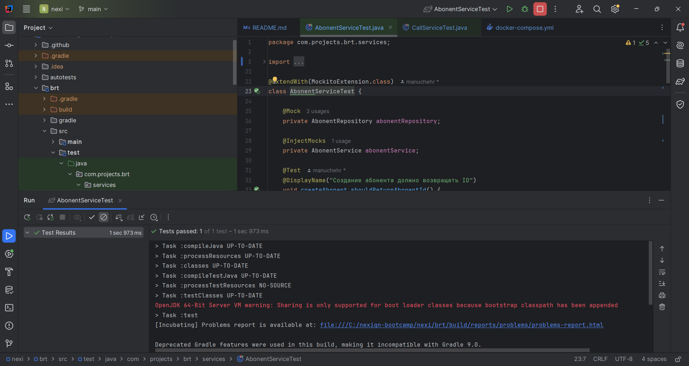

CallServiceTest

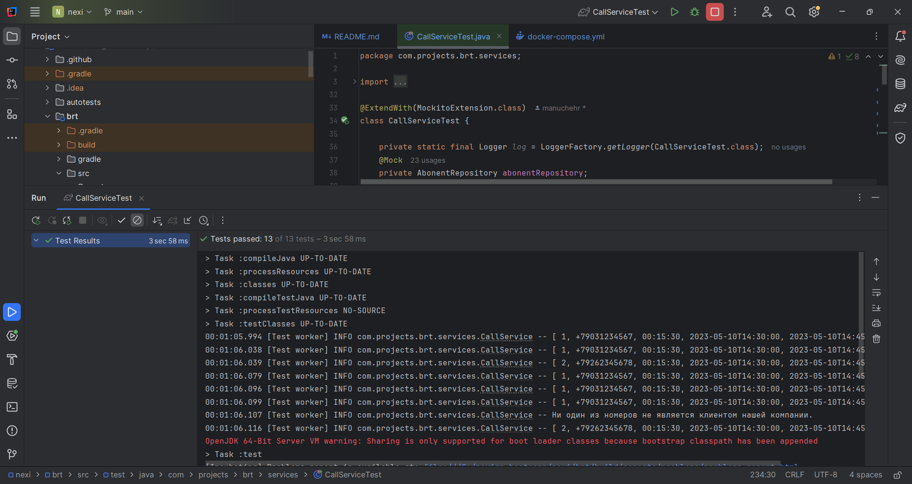

BalanceServiceTest

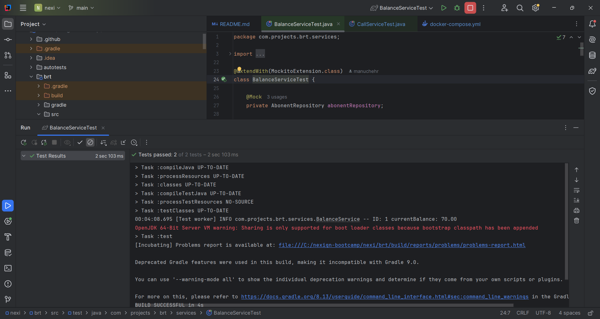

<h2>HRS</h2>

Данные для подключения PostgreSQL:

<ul>
    <li>Username: postgres</li>
    <li>Password: postgres</li>
    <li>Database: hrsdb</li>
    <li>Ports: 5433:5432</li>
</ul>

Сервис HRS имеет один REST /api/abonent/create - подключить тариф к абоненту

<h3>Схема бд HRS</h3>

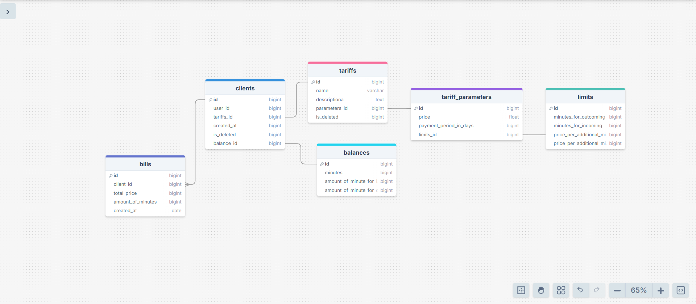

На схеме представлена база данных HRS. 

<ul>
    <li>clients - наши клиенты у которых подключен тариф</li>
    <li>bills - счета, которые выписываются клиентам</li>
    <li>balances - балансы пользователей. хранит остатки минут для исходящих и входящих вызовов.</li>
    <li>tariffs - доступные тарифы</li>
    <li>tariff_parameters - условия тарифа (период оплаты тарифа, сумма оплаты и ограничения по тарифу)</li>
    <li>limits - ограничения по тарифу</li>
</ul>
<h3></h3>

AbonentServiceTest

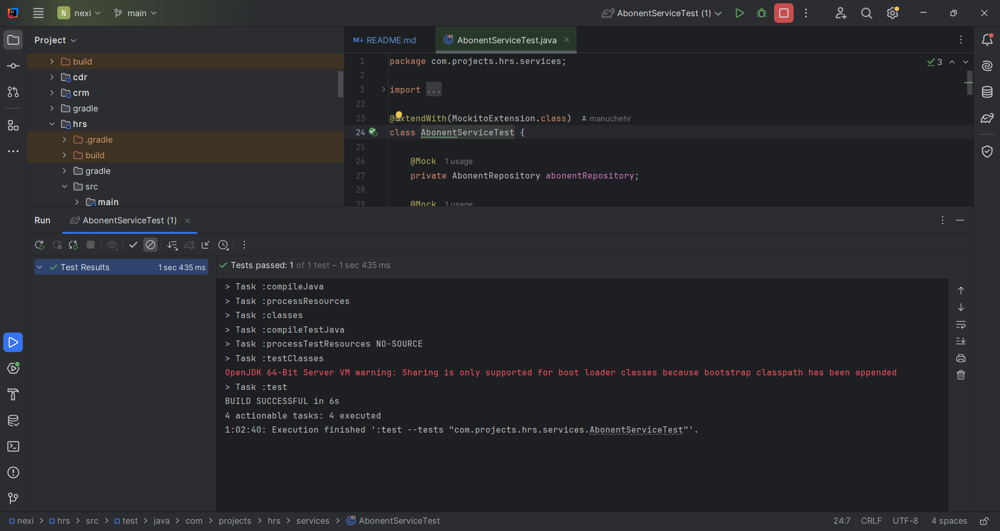

BalanceServiceTest

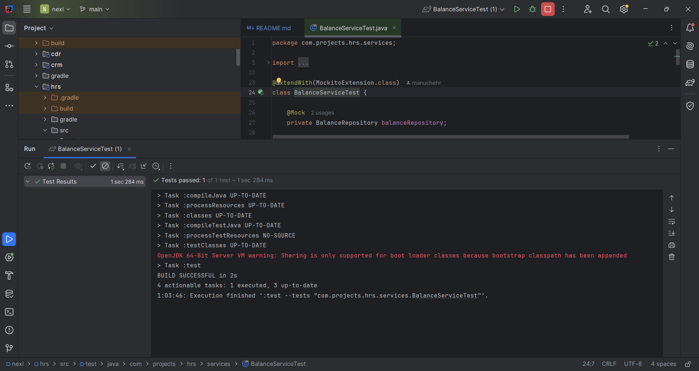

CallTarificationTest

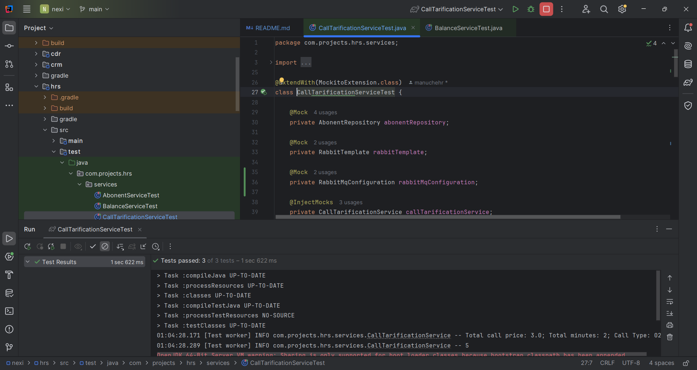

HrsServiceTest

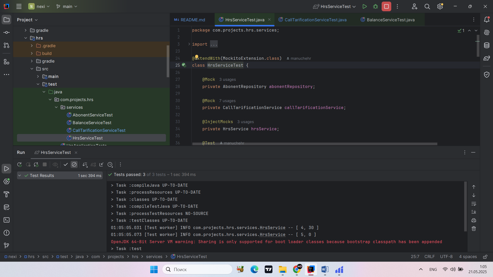

<h2>CRM</h2>

Регистрация и аутентификация происходит на основе JWT токена, так как этот тип аутентификации легко интегрируется с Rest Api и универсальности.

Данные для подключения PostgreSQL:

<ul>
    <li>Username: postgres</li>
    <li>Password: postgres</li>
    <li>Database: crmdb</li>
    <li>Ports: 5434:5432</li>
</ul>

Данные для входа аккаунта менеджера:

<ul>
    <li>email: manager@example.com</li>
    <li>password: 1234</li>
</ul>

Данные для входа в аккаунт одного из пользователей:

<ul>
    <li>email: user1@example.com</li>
    <li>password: 1234</li>
</ul>

Эндпоинты: 

<ul>
    <li>/api/auth/register - регистрация пользователя</li>
    <li>/api/auth/authenticate - аутентификация пользователя</li>
</ul>

<h3>Схема бд CRM</h3>

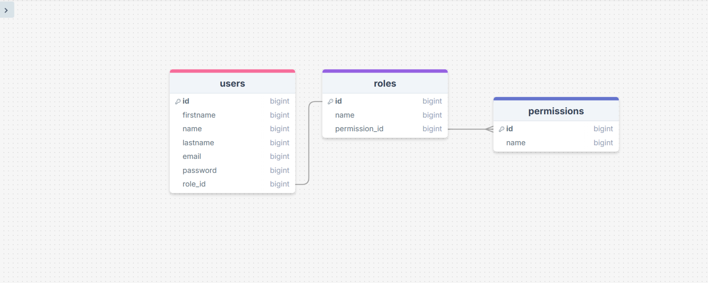

На схеме представлена база данных HRS. 

<h2>Развертывание с помощью Docker</h2>

<code> docker-compose up -d --build </code> 
<code> docker-compose down -v </code>

<h2> Отчет по тестированию </h2>

https://docs.google.com/document/d/1MQzoKOgutOlNawWUD4Ko00nUWXyhnz-fYibV7qfDHsI/edit?tab=t.0
