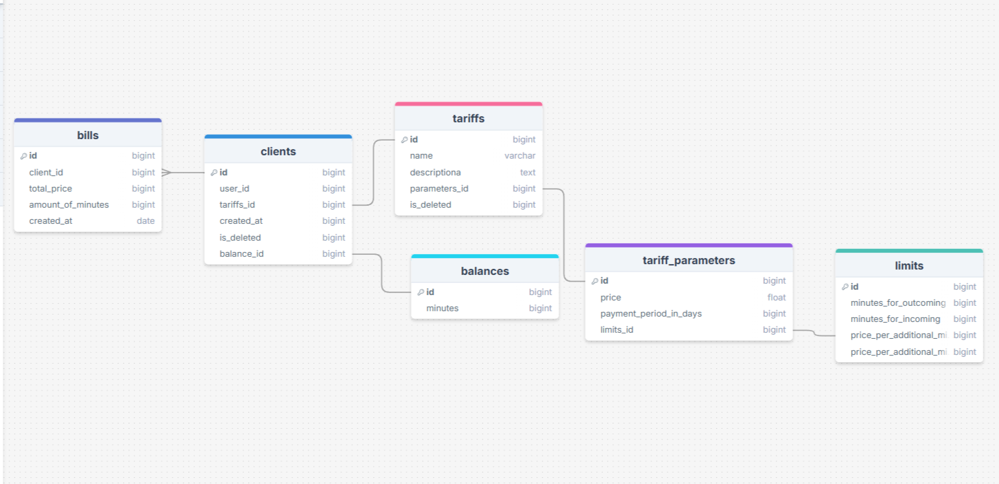

<h1>README.MD</h1>

<blockquote>

Примечание: В силу не хватки времени из-за учебы и неопытности инженера в плане микросервисной архитектуры, некоторый функционал всего проекта не был реализован. Инженер дает себе отчетность в том что данный проект можно было сделать лучше, чем он есть на самом деле.

</blockquote>

<h2>Используемые технологии</h2>
<ul>
    <li>Java 17</li>
    <li>Spring Boot 3.3</li>
    <li>Mockito</li>
    <li>Spring Security</li>
    <li>Lombok</li>
    <li>PostgreSQL</li>
    <li>H2 DB</li>
</ul>

<h2> Схема взаимодействия CDR, BRT и HRS микросервисов.</h2>

Все они общаются между собой через брокер RabbitMQ. Таблицы brt-db и hrs-db - были полностью спроектированы инженером, в силу того, что у аналитика не было возможности спроектировать их, из-за учебы.

<h2>CDR</h2>

 У Cdr Service есть один эндпоинт: <i>/cdr/generate</i>, который генерирует звонки 

<h2>BRT</h2>

Сервис BRT имеет один эндпоинт: /api/abonent/create - создать абонента

Схема бд BRT

<h2>HRS</h2>

Сервис HRS имеет один /api/abonent/create - подключить тариф к абоненту

Схема бд HRS

<h2>Развертывание с помощью Docker</h2>
<code> docker-compose up -d --build </code> 
<code> docker-compose down -v </code>

<h2> Отчет по тестированию </h2>
https://docs.google.com/document/d/1MQzoKOgutOlNawWUD4Ko00nUWXyhnz-fYibV7qfDHsI/edit?tab=t.0
