# README.md

> **Примечание**: В силу нехватки времени из-за учёбы и неопытности инженера в микросервисной архитектуре, некоторый функционал проекта не был реализован. Инженер осознаёт, что проект можно было сделать лучше.

## Используемые технологии

* Java 17
* Spring Boot 3.3
* Mockito
* Spring Security
* Lombok
* PostgreSQL
* H2 DB

## Схема взаимодействия CDR, BRT и HRS микросервисов

Все микросервисы обмениваются данными через брокер RabbitMQ, поскольку все передаваемые данные критически важны. Таблицы `brt-db` и `hrs-db` были спроектированы инженером, так как аналитик не имел возможности этим заняться из-за учёбы.

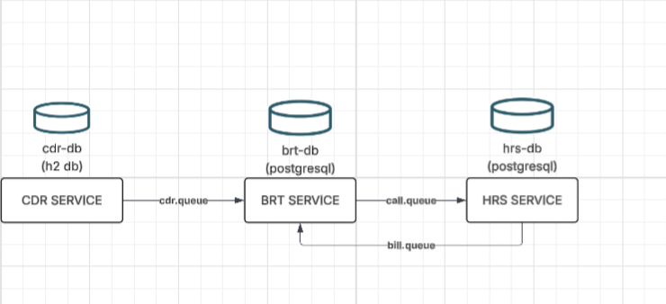

1. Данные генерируются в CDR Service и отправляются в очередь `cdr.queue`.
2. BRT Service получает CDR-ы из очереди и сохраняет в базу данных информацию о звонке (номер пользователя, время, длительность, тип).
3. После сохранения данных BRT отправляет в очередь `call.queue` информацию о длительности звонка и ID пользователя, чтобы HRS мог выставить счёт.
4. HRS Service определяет тариф и выставляет счёт, списывает средства по абонентской плате. Затем отправляет счёт в `bill.queue`.
5. BRT Service перехватывает счета и списывает деньги с баланса абонента.

> В проекте используются дефолтные значения для подключения к базам данных и брокеру. Инженер осознаёт, что в реальных проектах должны использоваться безопасные данные для аутентификации, но в рамках проекта было принято упростить.

---

## CDR

**Доступ к H2 Console:**

* Driver class: `org.h2.Driver`
* JDBC URL: `jdbc:h2:mem:testdb`
* User Name: `admin`
* Password: *(отсутствует)*

Эндпоинт: `/cdr/generate` — генерирует звонки.

Параметры в `application.yaml`:

```yaml
cdr:
  max-cdr-amount-before-sending-to-queue: 10
  amount-of-cdr-generations-at-one-time: 1000
```

Сгенерированные данные отправляются в очередь `call.queue` в формате JSON по следующим причинам:

* Поддержка вложенности
* Гибкость и расширяемость
* Совместимость с API и брокерами
* Автоматическая сериализация
* Стандарты валидации (JSON Schema)
* Устойчивость к ошибкам
* Читаемость
* Удобство логирования и хранения

После генерации нужного количества CDR, они отправляются в очередь сообщений `call.queue` и обрабатываются BRT.

---

## BRT

**Доступ к PostgreSQL:**

* Username: `postgres`
* Password: `postgres`
* Database: `brtdb`
* Ports: `5432:5432`

### Эндпоинты:

* `/api/balance/top-up` — пополнение баланса
* `/api/abonent/create` — регистрация абонента

### Схема БД BRT

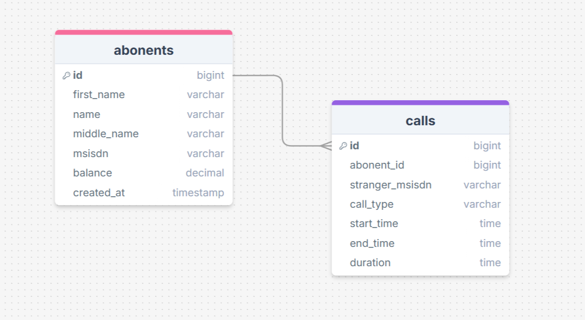

### Тесты:

* AbonentServiceTest 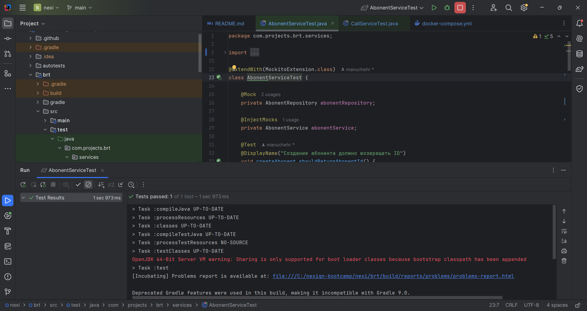
* CallServiceTest 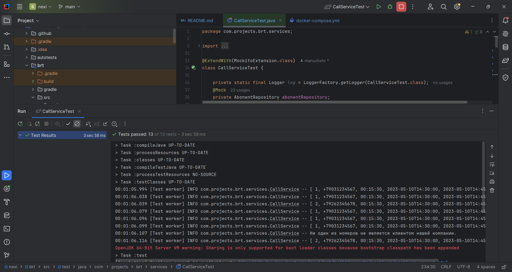
* BalanceServiceTest 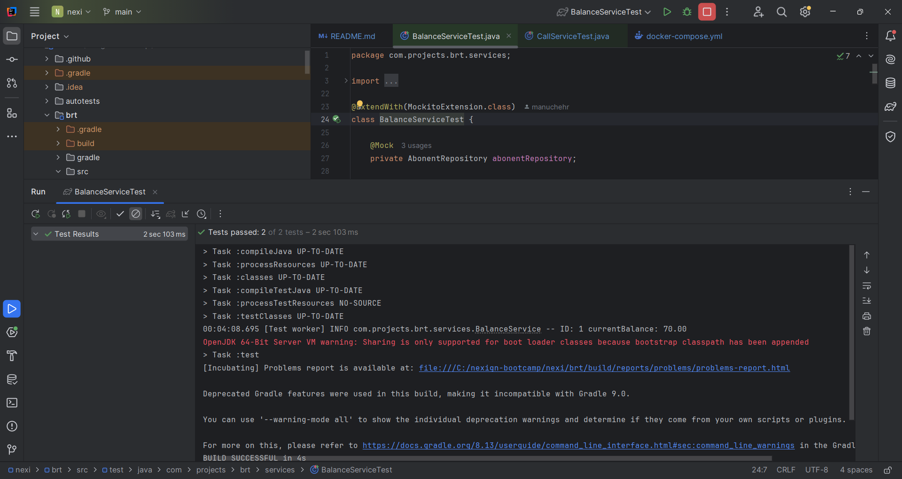

---

## HRS

**Доступ к PostgreSQL:**

* Username: `postgres`
* Password: `postgres`
* Database: `hrsdb`
* Ports: `5433:5432`

Эндпоинт: `/api/abonent/create` — подключение тарифа к абоненту

### Схема БД HRS

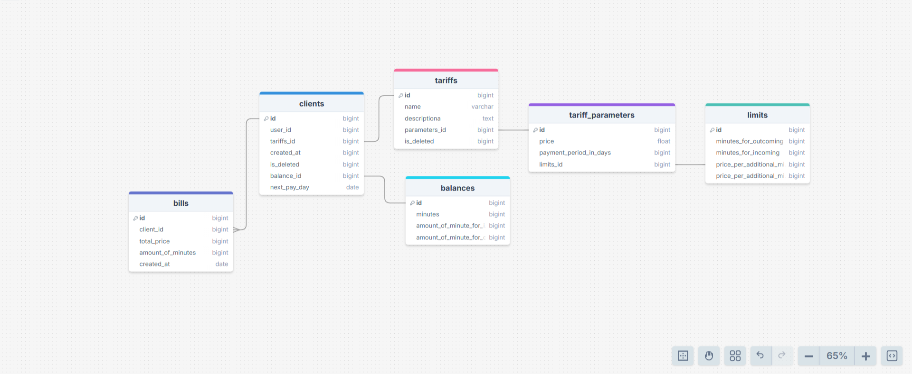

Описание таблиц:

* `clients` — клиенты с подключённым тарифом
* `bills` — счета
* `balances` — остатки минут
* `tariffs` — тарифы
* `tariff_parameters` — параметры тарифов (сумма, период, ограничения)
* `limits` — лимиты по тарифам

Сервис проверяет поле `next_pay_day` и выписывает счёт за период, обновляя дату следующего списания.

### Тесты:

* AbonentServiceTest 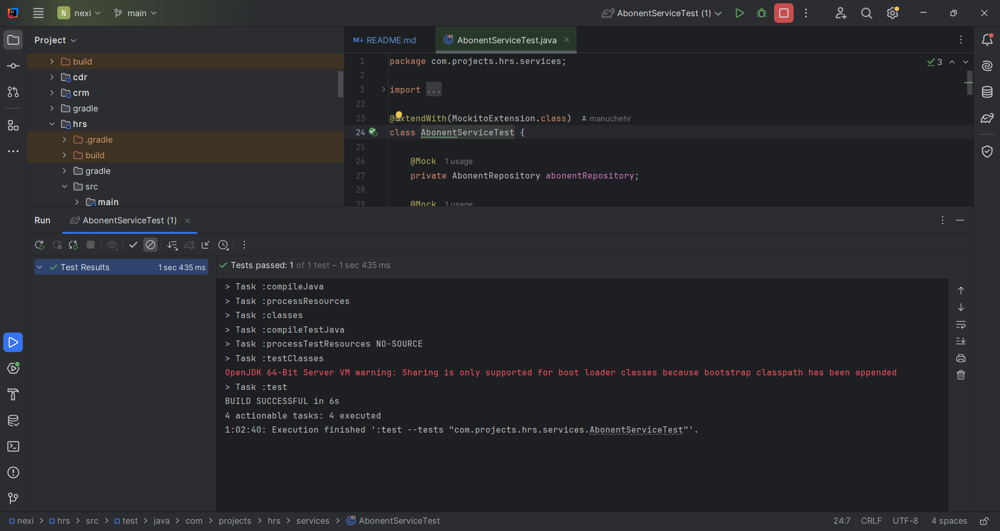
* BalanceServiceTest 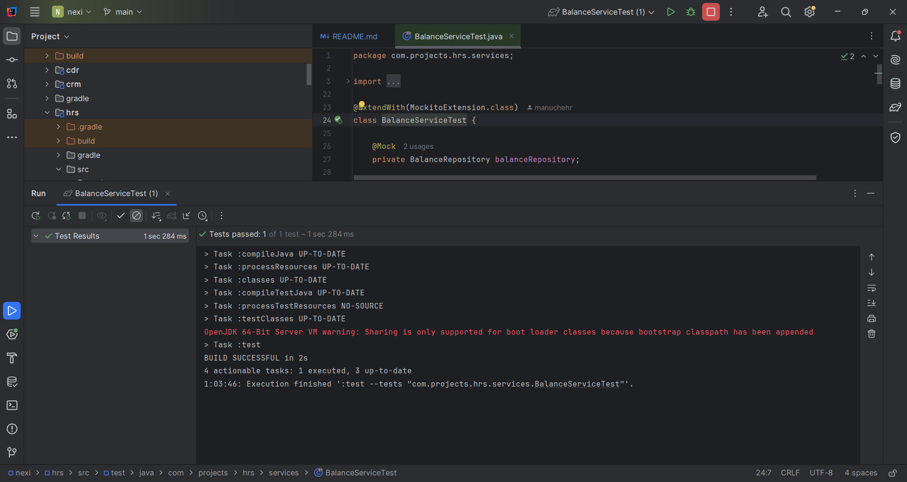
* CallTarificationTest 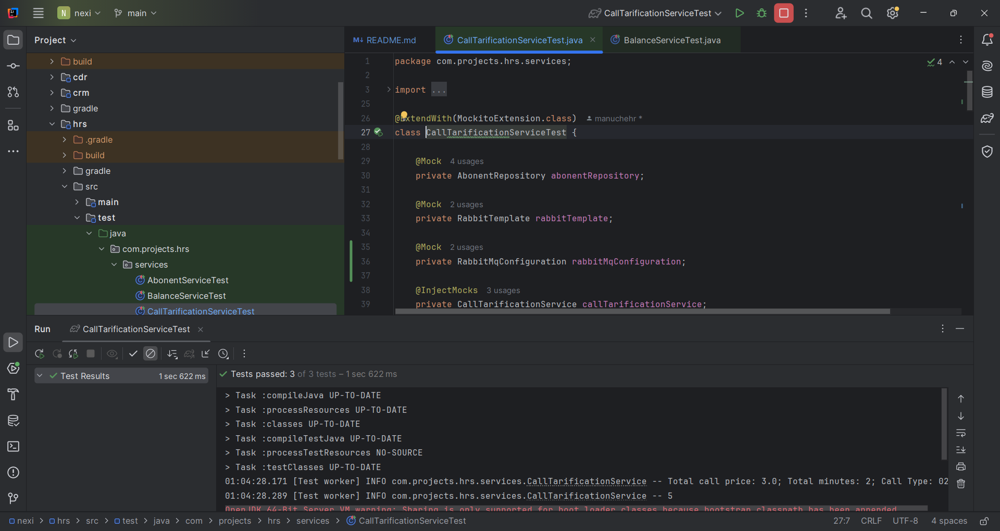
* HrsServiceTest 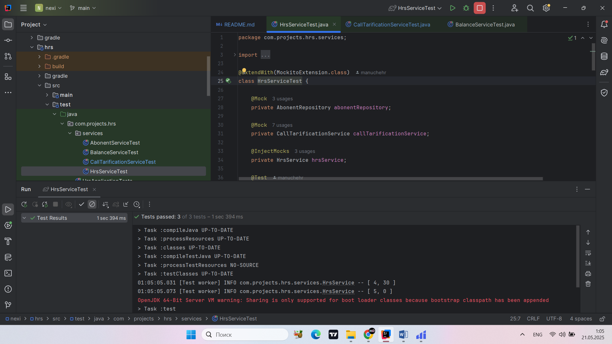

---

## CRM

JWT аутентификация используется для REST API благодаря удобству и универсальности.

**Доступ к PostgreSQL:**

* Username: `postgres`
* Password: `postgres`
* Database: `crmdb`
* Ports: `5434:5432`

**Данные аккаунтов:**

**Менеджер:**

* email: `manager@example.com`
* password: `1234`

**Пользователь:**

* email: `user1@example.com`
* password: `1234`

### Эндпоинты:

* `/api/auth/register` — регистрация
* `/api/auth/authenticate` — аутентификация

### Схема БД CRM

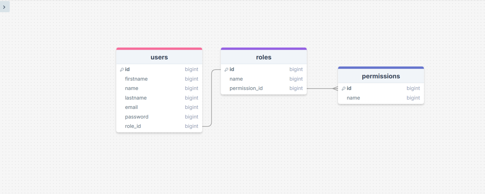

---

## Развёртывание с помощью Docker

```bash
docker-compose up -d --build
docker-compose down -v
```

---

## Отчёт по тестированию

[Открыть Google Документ](https://docs.google.com/document/d/1MQzoKOgutOlNawWUD4Ko00nUWXyhnz-fYibV7qfDHsI/edit?tab=t.0)
